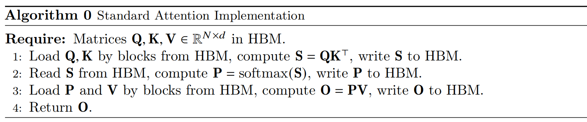
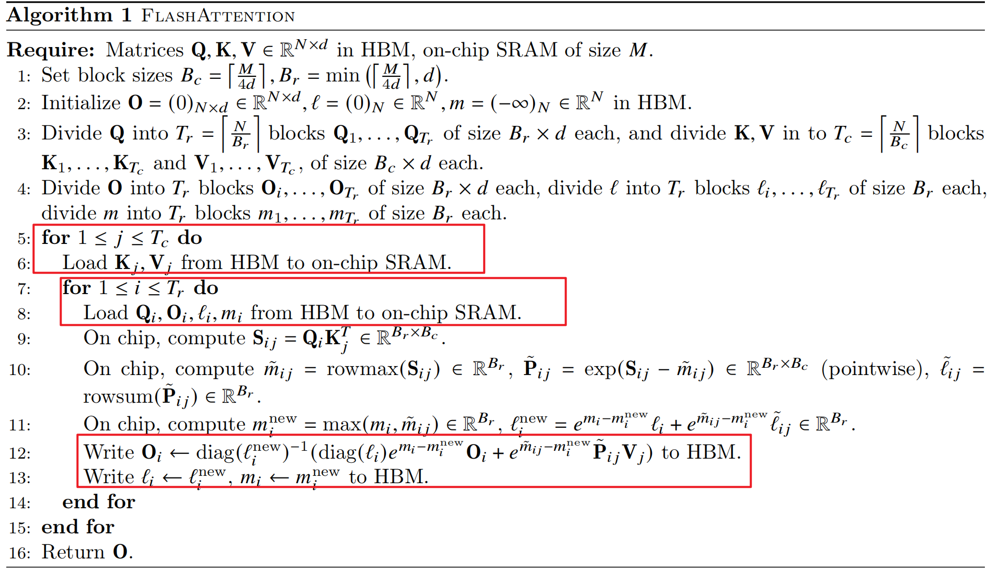
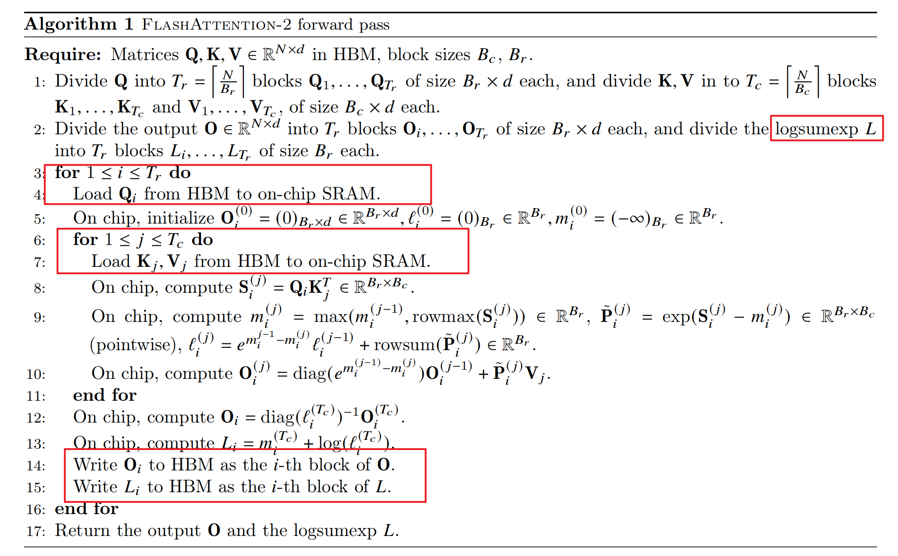

# Flash attention 1/2的时间空间复杂度简单分析
- [Flash Attention project](https://github.com/Dao-AILab/flash-attention)
- [Flash Attention 1 paper](https://arxiv.org/abs/2205.14135)
- [Flash Attention 2 paper](hhttps://arxiv.org/abs/2307.08691)
## Standard Attention
### FLOPS
- $Q_{N×d}K^T_{d×N}$：就是一个矩阵乘法，矩阵乘法$A_{M×K}$ $B_{K×N}$的`FLOPS`是`MNK`，所以这里的`FLOPS`是$O(N^2d)$
- $S_{N×N}V_{N×d}$：$O(N^2d)$
- 所以总的`FLOPS`是：$O(N^2d)$
### Space
- 存储中间结果`S`：$O(N^2)$
### IO(HBM)
- 读`Q、K、V`：$O(Nd)$
- 读写中间值`S`：$O(N^2)$
- 写结果`O`：$O(Nd)$
- 所以总的`IO`是：$O(Nd+N^2d)$

## Flash Attention 1
### FLOPS
- 虽然用了`tilling`分块，但是`FLOPS`的大头还是矩阵乘法
- 总共`Tc * Tr`($\frac {N}{B_{c}} * \frac {N}{B_{r}}$)次小块的计算
- 每个小块的`FLOPS`：$O(B_{r}B_{c}d)$
- 总的`FLOPS`：$O(B_{r}B_{c} * d * T_{c} * T_{r})$ = $B_{r}B_{c} * d * \frac {N}{B_{c}} * \frac {N}{B_{r}}$ = $O(N^2d)$
### Space
- 对于`output`的每一行，需要额外存储`m`和`l`：$O(N)$
### IO(HMB)
- 读`K、V`：$O(Nd)$
- 读`Q`：$T_{c} * O(Nd)$ = $O(T_{c}Nd)$
- 写`O`：$T_{c} * O(Nd)$ = $O(T_{c}Nd)$(`output`和`Q`的`shape`是一样的，所以读`Q`和写`O`的`IO`次数是一样的)
- 总共的`IO`：$O(Nd) + O(2T_{c}Nd)$ = $O(Nd) + O(2\frac{N}{B_{c}}Nd)$
- $B_{c} = \frac{M}{4d}$
- 所以：$O(Nd) + O(\frac{N}{B_{c}}Nd)$ = $O(Nd) + O(\frac{4dN}{M}Nd)$ = $O(Nd) + O(2\frac{4N^2d^2}{M})$

### 对比
- Standard Attention：$O(N^2d)$
- Flash Attention 1：$O(\frac{4N^2d^2}{M})$
- $\frac{Flash Attention 1}{Standard Attention}$ = $\frac{4d^2}{M} << 1$
> For typical values of 𝑑 (64-128) and 𝑀 (around 100KB), 𝑑^2 is many times smaller than 𝑀, and thus
FlashAttention requires many times fewer HBM accesses than standard implementation.

### Implement
- 在`flash.cu`中的`myForward_kernel`
- 每个`block`负责一个一小块的结果，一个线程负责一行的`Q`和`output`

## Flash Attention 2
- 增加`N`维度的并行
- 更改`i`和`j`的循环次序
- 减少非矩阵乘法的次数
### FLOPS
- 不变
### Space
- 对于`output`的每一行，需要额外存储`l`：$O(N)$
### IO
- 读`Q`：$O(Nd)$
- 读`K、V`：$T_{c} * O(Nd)$ = $O(T_{c}Nd)$
- 写`O`：$O(Nd)$(`output`和`Q`的`shape`是一样的，所以读`Q`和写`O`的`IO`次数是一样的)
- 最直观的就是写`O`的次数少了：从$O(\frac{4N^2d^2}{M})$降到了$O(Nd)$
### Implement
- 在`flash.cu`中的`myForward_kernel2`
- 每个`block`负责一个一小块的结果，一个线程负责一行的`Q`和`output`

## 时间比较
|    | Shape | CPU |  CUDA(3090)  |
|--------|-----|----------|----------|
| Standard   | [16, 12, 64, 64]  | 1.288s | 1.288s |
| Standard   | [16, 12, 256, 64]  | 1.664ms | 1.664ms |
| Standard   | [16, 12, 2048, 64]  | 38.963ms | 38.986ms |
| Flash 1   | [16, 12, 64, 64]  | 1.865ms | 1.288s |
| Flash 1   | [16, 12, 256, 64]  | 1.664ms | 735.000us |
| Flash 1   | [16, 12, 2048, 64]  | 19.276ms | 1.439ms |
| Flash 2   | [8, 12, 64, 64]  | 1.454ms | 602.000us |

## 总结
- flash attention1中的on chip memory没有$O_{B_{r}×d}$
- flash attention2中不要在HBM上开$m_{B×nh×N}$
